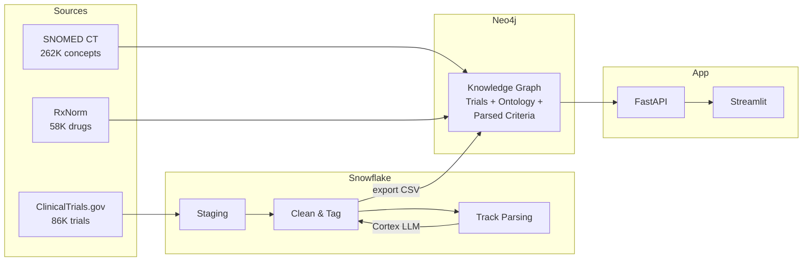

# Clinical Trial Eligibility Matcher

Match patients to eligible clinical trials using a **Neo4j knowledge graph**, **SNOMED CT / RxNorm** medical ontologies, **Snowflake** for data staging, and **LLMs** for criteria parsing and explanations.

## Why This Exists

There are 80,000+ active clinical trials on ClinicalTrials.gov, each with complex eligibility criteria written in medical jargon. A patient with breast cancer might qualify for hundreds of trials but would never find them manually. This system ingests all those trials, builds a knowledge graph connecting trials to medical concepts, and matches patients to eligible trials in seconds using graph traversal — not brute-force text search.

## Architecture



### Two Retrieval Approaches

The system offers **two candidate retrieval methods** — both feed into the same exclusion filter and scoring pipeline.

**Approach 1 — Baseline Graph Traversal (deterministic, $0 per query):**
Walks the SNOMED IS_A hierarchy 0-3 hops upward from the patient's condition. Fast, explainable, and always consistent.

**Approach 2 — ReKnoS Multi-hop Reasoning (LLM-guided, ~$0.01 per query):**
Adapted from our midterm research paper: *"Reasoning of Large Language Models over Knowledge Graphs with Super-Relations"* (Published as a conference paper at ICLR 2025). Uses **super-relations** — abstract traversal steps over the knowledge graph — with an LLM selecting the most promising reasoning path at each hop. This produces more relevant and accurate results by discovering trials through biomarker→criterion→trial and drug→criterion→trial paths that the baseline's fixed hierarchy walk cannot reach (e.g., tumor-agnostic immunotherapy trials for TMB-high patients, or PARP inhibitor trials for BRCA-mutant patients). Results are **unioned** with the baseline — existing matches are never dropped, only augmented with higher-relevance candidates.

Both approaches are available in the UI via a toggle. ReKnoS is optional and augments the baseline.

```
Patient Profile
    |
    v
Stage 1: Candidate Retrieval
    ├── Baseline: SNOMED IS_A traversal (0-3 hops)
    └── + ReKnoS (optional): LLM-guided multi-hop via super-relations
    |
    v
Stage 2: Exclusion filter (age, gender, drugs, conditions, biomarkers)
    |
    v
Stage 3: Score 0-100 (condition 40 + biomarker 25 + therapy 15 + demographics 10 + quality 10)
    |
    v
Stage 4: Top N results + optional LLM explanations
```

## Quick Start

### Option A: Full Pipeline (with Snowflake + real data)

Requires: Docker, Python 3.11+, Snowflake account, OpenAI API key.

```bash
# 1. Clone and configure
git clone <repo-url>
cd clinical-trial-matcher
cp .env.example .env        # Edit with your credentials

# 2. Install dependencies
pip install -e .

# 3. Start Neo4j
docker compose up -d

# 4. If you have the neo4j.dump file (skip steps 5-8):
docker compose stop neo4j
docker run --rm \
  -v clinical-trial-matcher_neo4j_data:/data \
  -v ./backup:/backup \
  neo4j:5.26-community neo4j-admin database load neo4j --from-path=/backup --overwrite-destination
docker compose start neo4j

# 5. Or load from Snowflake (if data is in Snowflake):
python -m snowflake_etl.export_for_neo4j --category oncology --parsed-only

# 6. Build ontology backbone
python -m kg_builder.build_ontology

# 7. Load trials
python -m kg_builder.load_trials --category oncology

# 8. Entity linking + graph enrichment
python -m kg_builder.link_entities
python -m nlp.criteria_parser --category oncology --enrich

# 9. Start the app
uvicorn api.main:app --reload        # Terminal 1
streamlit run frontend/app.py        # Terminal 2
```

### Option B: Demo Mode (no Snowflake required)

```bash
# 1. Clone and configure
cp .env.example .env        # Set NEO4J_PASSWORD and OPENAI_API_KEY

# 2. Install and start Neo4j
pip install -e .
docker compose up -d

# 3. Seed demo data (30 curated trials)
python scripts/seed_demo_data.py

# 4. Start the app
uvicorn api.main:app --reload        # Terminal 1
streamlit run frontend/app.py        # Terminal 2
```

### Option C: From Database Dump (fastest)

If you have `backup/neo4j.dump` (194 MB file with the full graph):

```bash
cp .env.example .env        # Set NEO4J_PASSWORD and OPENAI_API_KEY
pip install -e .
docker compose up -d
docker compose stop neo4j
# Load the dump (Linux/Mac):
docker run --rm \
  -v clinical-trial-matcher_neo4j_data:/data \
  -v $(pwd)/backup:/backup \
  neo4j:5.26-community neo4j-admin database load neo4j --from-path=/backup --overwrite-destination
# Load the dump (Windows with Git Bash):
MSYS_NO_PATHCONV=1 docker run --rm \
  -v clinical-trial-matcher_neo4j_data:/data \
  -v "$(pwd)/backup":/backup \
  neo4j:5.26-community neo4j-admin database load neo4j --from-path=/backup --overwrite-destination
docker compose start neo4j
uvicorn api.main:app --reload        # Terminal 1
streamlit run frontend/app.py        # Terminal 2
```

Open http://localhost:8501 in your browser.

## Configuration

All configuration is via environment variables in `.env`. See `.env.example` for the full template.

| Variable | Required | Description |
|----------|----------|-------------|
| `NEO4J_PASSWORD` | Yes | Password for the Neo4j database |
| `OPENAI_API_KEY` | Yes | OpenAI API key (for free-text parsing + explanations) |
| `SNOWFLAKE_ACCOUNT` | For full pipeline | Snowflake account identifier |
| `SNOWFLAKE_USER` | For full pipeline | Snowflake username |
| `SNOWFLAKE_PASSWORD` | For full pipeline | Snowflake password |
| `LLM_PROVIDER` | No (default: openai) | `openai` or `anthropic` |
| `LLM_MODEL` | No (default: gpt-4o-mini) | Model to use for parsing/explanations |

## Example

**Input (free text):**
> 58-year-old woman with HER2-positive breast cancer, previously treated with trastuzumab, ECOG 1.

**What happens:**
1. LLM extracts: age=58, gender=Female, conditions=[breast cancer], biomarkers=[HER2+], prior_therapies=[trastuzumab]
2. Entity linker resolves: breast cancer → SNOMED 254837009, trastuzumab → RxNorm 224905
3. Graph traversal finds candidate trials via SNOMED IS_A hierarchy (0-3 hops)
4. Exclusion filter removes trials that exclude her age, gender, or prior trastuzumab
5. Remaining trials scored 0-100 across 5 dimensions
6. Top results returned with LLM-generated explanations

**Output:** Ranked list of matching trials with scores, breakdowns, and plain-language explanations.

## Category Filtering

Trials are tagged by therapeutic area during Snowflake transformation:

| Area | Keyword patterns |
|------|-----------------|
| Oncology | cancer, carcinoma, tumor, lymphoma, leukemia, melanoma... |
| Cardiology | heart, cardiac, hypertension, coronary, arrhythmia... |
| Neurology | alzheimer, parkinson, epilepsy, multiple sclerosis... |
| Endocrinology | diabetes, thyroid, obesity, metabolic... |
| Psychiatry | depression, anxiety, schizophrenia, bipolar... |

The full pipeline processes all 86K trials but loads them into Neo4j by category (`--category oncology`). Currently, oncology (24K trials) is loaded. Other areas can be added without re-fetching data.

## Project Structure

```
clinical-trial-matcher/
├── config/            # Pydantic settings (loads .env)
├── data/              # Raw + processed data files (gitignored)
├── data_ingestion/    # ClinicalTrials.gov, SNOMED, RxNorm parsers
├── snowflake_etl/     # Staging, transform, export, tracking
├── kg_builder/        # Neo4j loaders (ontology + trials)
├── nlp/               # Criteria parser (Cortex), entity linker, prompts
├── matcher/           # Matching engine, patient schema, scorer
├── llm/               # LLM provider (OpenAI/Anthropic), explainer
├── api/               # FastAPI backend (4 endpoints)
├── frontend/          # Streamlit UI
├── scripts/           # Pipeline runners, demo seeder, test patients
├── docs/              # Deep dive documentation, setup guide
├── tests/             # Test suite
└── backup/            # Neo4j database dump (gitignored)
```

## API Endpoints

| Method | Path | Description |
|--------|------|-------------|
| `GET` | `/` | Health check + Neo4j connectivity |
| `POST` | `/match` | Match patient profile to trials |
| `POST` | `/patient/parse` | Parse free-text description to structured profile |
| `GET` | `/trials/{nct_id}` | Get full trial detail with criteria |
| `GET` | `/stats` | Knowledge graph statistics |

API docs: http://localhost:8000/docs (Swagger UI)

## Data Sources & Licenses

| Source | License | Notes |
|--------|---------|-------|
| [ClinicalTrials.gov](https://clinicaltrials.gov) | Public domain | No API key required |
| [SNOMED CT](https://www.snomed.org) | UMLS license (free) | Requires NLM account for download |
| [RxNorm](https://www.nlm.nih.gov/research/umls/rxnorm/) | Public domain | Part of UMLS distribution |

## Disclaimer

This system is for **research and educational purposes only**. It is **not** a medical device and should not be used to make clinical decisions. Always consult a qualified healthcare professional before enrolling in any clinical trial. The matching results are based on automated processing and may contain errors or omissions.
