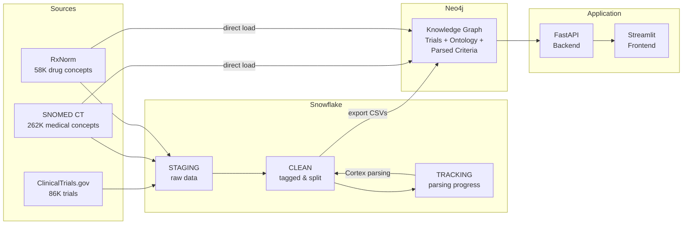
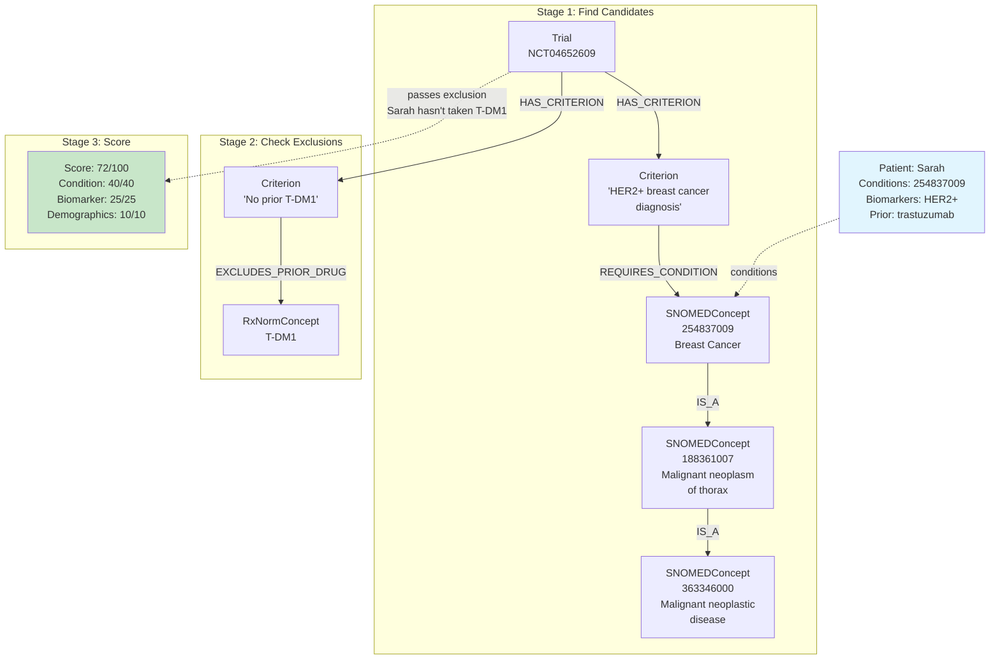
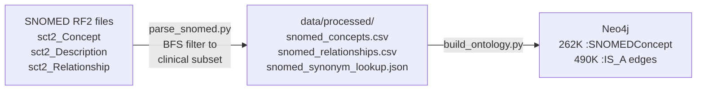
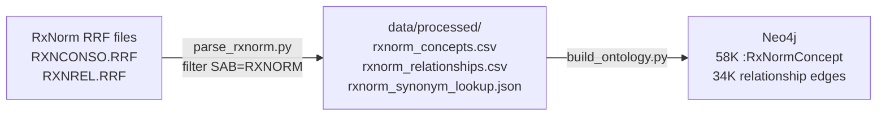
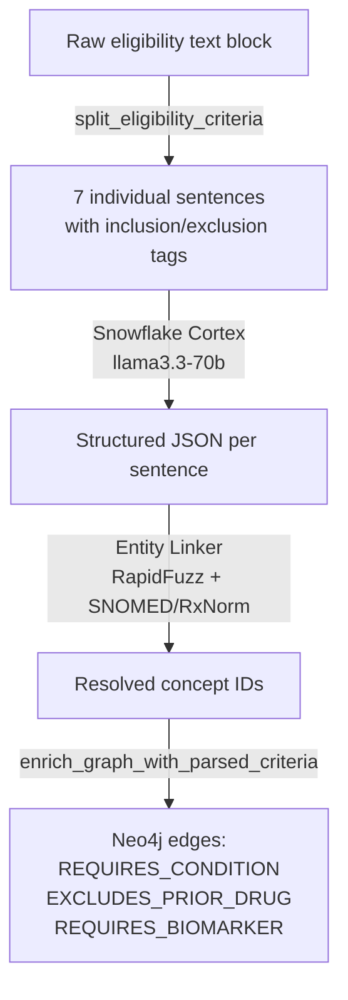
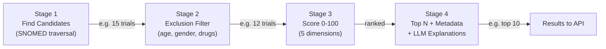
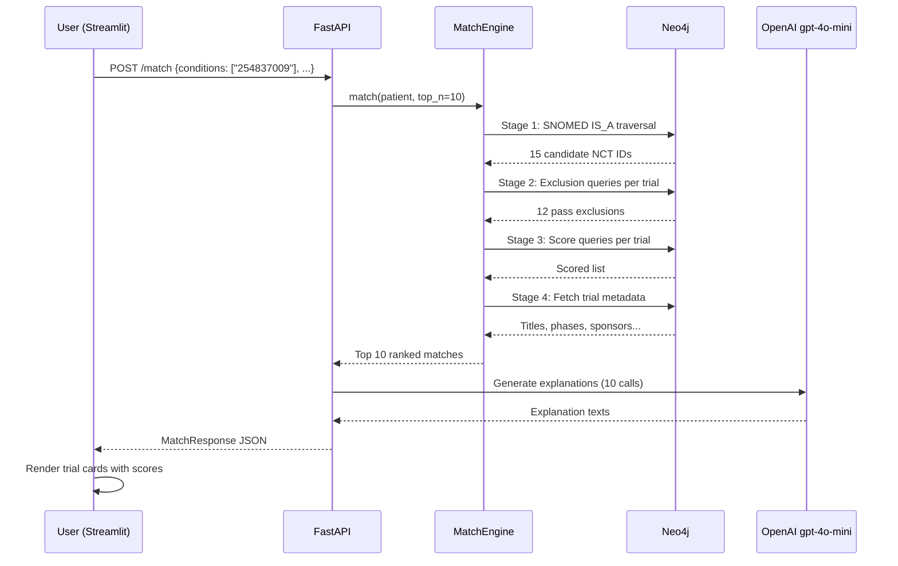

# Clinical Trial Eligibility Matcher — Project Deep Dive

> **Running example throughout this document:**
> *Sarah, a 58-year-old female with HER2-positive breast cancer who has previously been treated with trastuzumab. ECOG performance status 1.*

---

## 1. The Big Picture

**What problem does this solve?** There are over 80,000 active clinical trials on ClinicalTrials.gov, each with complex eligibility criteria written in medical jargon. A patient with breast cancer might qualify for hundreds of trials but would never find them manually. This system ingests all those trials, builds a knowledge graph connecting trials to medical concepts (diseases, drugs, biomarkers), and matches patients to eligible trials in seconds using graph traversal — not brute-force text search.

**How it works in one sentence:** Raw trial data flows through Snowflake (cleaning) into Neo4j (graph), where SNOMED and RxNorm medical ontologies enable intelligent matching via hierarchy traversal, and an LLM generates human-readable explanations.



---

## 2. The Knowledge Graph — Nodes and Edges

### Node Types

#### Trial
**What it is:** A single clinical trial from ClinicalTrials.gov.

| Property | Type | Example |
|----------|------|---------|
| `nct_id` | string | `"NCT04652609"` |
| `title` | string | `"Preventing Chemotherapy-induced Peripheral Neuropathy..."` |
| `brief_summary` | text | Full trial description |
| `status` | string | `"RECRUITING"` or `"ACTIVE_NOT_RECRUITING"` |
| `phase` | string | `"Phase 3"`, `"Phase 2"`, etc. |
| `enrollment` | integer | `500` |
| `min_age` / `max_age` | integer | `18` / `75` |
| `gender` | string | `"FEMALE"`, `"ALL"` |
| `therapeutic_area` | string | `"oncology"` |
| `sponsor` | string | `"National Cancer Institute"` |
| `url` | string | `"https://clinicaltrials.gov/study/NCT04652609"` |

**Sarah's example:** The system finds trials like NCT04652609 ("Preventing Chemotherapy-induced Peripheral Neuropathy") which studies HER2+ breast cancer and is currently recruiting.

#### SNOMEDConcept
**What it is:** A medical concept from the SNOMED CT ontology — the international standard for clinical terminology. SNOMED organizes diseases, procedures, and body structures into a hierarchy using IS_A relationships.

| Property | Example |
|----------|---------|
| `concept_id` | `"254837009"` |
| `term` | `"Malignant neoplasm of breast"` |
| `semantic_tag` | `"disorder"` |

**Sarah's example:** Her breast cancer maps to SNOMED concept 254837009 ("Malignant neoplasm of breast"). This concept IS_A "Malignant neoplasm of thorax" (parent) and has children like "Lobular carcinoma of breast", "Carcinoma of breast", "HER2-positive breast cancer" (427685000).

#### RxNormConcept
**What it is:** A drug concept from the RxNorm vocabulary — the US standard for clinical drug names. Maps brand names to generic ingredients.

| Property | Example |
|----------|---------|
| `rxcui` | `"224905"` |
| `name` | `"trastuzumab"` |
| `tty` | `"IN"` (ingredient) |

**Sarah's example:** Her prior therapy trastuzumab is RxNorm CUI 224905. Through TRADENAME_OF relationships, we know Herceptin is a brand name for trastuzumab.

#### Condition
**What it is:** A disease or condition studied by a trial. Acts as a bridge between Trial nodes and the SNOMED ontology.

| Property | Example |
|----------|---------|
| `name` | `"Breast Cancer"` |
| `normalized_name` | `"malignant neoplasm of breast"` |

#### Intervention
**What it is:** A treatment used in a trial — could be a drug, procedure, radiation, behavioral intervention, etc.

| Property | Example |
|----------|---------|
| `name` | `"Pembrolizumab"` |
| `normalized_name` | `"pembrolizumab"` |
| `type` | `"DRUG"` |

#### Criterion
**What it is:** A single parsed eligibility criterion sentence from a trial's inclusion or exclusion criteria. This is where the LLM parsing results live.

| Property | Example |
|----------|---------|
| `id` | `"ef1f433d-..."` (UUID) |
| `type` | `"inclusion"` or `"exclusion"` |
| `raw_text` | `"HER2+ breast cancer diagnosis"` |
| `parsing_status` | `"parsed"` |
| `parsed_json` | `{"category": "condition", "conditions": [{"name": "breast cancer"}], ...}` |

#### Biomarker
**What it is:** A molecular marker relevant to trial eligibility (e.g., HER2, EGFR, PD-L1).

| Property | Example |
|----------|---------|
| `name` | `"HER2"` |
| `normalized_name` | `"her2"` |

---

### Relationship Types

#### Trial-level relationships

| Relationship | Meaning | Example |
|-------------|---------|---------|
| `(Trial)-[:STUDIES_CONDITION]->(Condition)` | This trial studies this disease | NCT04652609 STUDIES_CONDITION "Breast Cancer" |
| `(Trial)-[:USES_INTERVENTION]->(Intervention)` | This trial uses this treatment | NCT04652609 USES_INTERVENTION "Pembrolizumab" |
| `(Trial)-[:HAS_CRITERION {type}]->(Criterion)` | This trial has this eligibility rule. Property `type` is "inclusion" or "exclusion" | NCT04652609 HAS_CRITERION {type: "inclusion"} -> "HER2+ breast cancer diagnosis" |

#### Criterion-level relationships (from LLM parsing + entity linking)

| Relationship | Meaning | Example |
|-------------|---------|---------|
| `(Criterion)-[:REQUIRES_CONDITION]->(SNOMEDConcept)` | This inclusion criterion requires this condition | "HER2+ breast cancer diagnosis" REQUIRES_CONDITION -> 254837009 |
| `(Criterion)-[:EXCLUDES_CONDITION]->(SNOMEDConcept)` | This exclusion criterion excludes patients with this condition | "No active brain metastases" EXCLUDES_CONDITION -> brain metastasis concept |
| `(Criterion)-[:REQUIRES_PRIOR_DRUG]->(RxNormConcept)` | Must have taken this drug | "Prior trastuzumab therapy required" REQUIRES_PRIOR_DRUG -> 224905 |
| `(Criterion)-[:EXCLUDES_PRIOR_DRUG]->(RxNormConcept)` | Must NOT have taken this drug | "No prior T-DM1" EXCLUDES_PRIOR_DRUG -> T-DM1 concept |
| `(Criterion)-[:REQUIRES_BIOMARKER {status}]->(Biomarker)` | Must have this biomarker status | REQUIRES_BIOMARKER {status: "positive"} -> HER2 |
| `(Criterion)-[:EXCLUDES_BIOMARKER {status}]->(Biomarker)` | Excludes patients with this biomarker status | EXCLUDES_BIOMARKER {status: "positive"} -> HBV DNA |

#### Ontology relationships

| Relationship | Meaning | Example |
|-------------|---------|---------|
| `(SNOMEDConcept)-[:IS_A]->(SNOMEDConcept)` | Child concept is a type of parent concept | "Malignant neoplasm of breast" IS_A "Malignant neoplasm of thorax" |
| `(Condition)-[:MAPS_TO_SNOMED]->(SNOMEDConcept)` | Free-text condition maps to this SNOMED concept | "Breast Cancer" MAPS_TO_SNOMED 254837009 |
| `(Intervention)-[:MAPS_TO_RXNORM]->(RxNormConcept)` | Free-text drug maps to this RxNorm concept | "pembrolizumab" MAPS_TO_RXNORM 1547545 |
| `(RxNormConcept)-[:HAS_INGREDIENT]->(RxNormConcept)` | Drug product contains this ingredient | Herceptin HAS_INGREDIENT trastuzumab |
| `(RxNormConcept)-[:TRADENAME_OF]->(RxNormConcept)` | Brand name for generic drug | Herceptin TRADENAME_OF trastuzumab |

### How Sarah's Query Traverses the Graph



---

## 3. Where Does the Data Come From?

### ClinicalTrials.gov API

**What is it?** The US federal database of clinical studies. We use the V2 API to fetch all actively recruiting trials.

**What we pull:** Trial metadata, conditions, interventions, eligibility criteria text, demographics.

**API endpoint:** `https://clinicaltrials.gov/api/v2/studies`

**Filters:** `filter.overallStatus=RECRUITING|ACTIVE_NOT_RECRUITING`

**Raw API response (simplified):**
```json
{
  "protocolSection": {
    "identificationModule": {
      "nctId": "NCT04652609",
      "briefTitle": "Preventing Chemotherapy-induced Peripheral Neuropathy..."
    },
    "statusModule": {
      "overallStatus": "RECRUITING"
    },
    "designModule": {
      "phases": ["PHASE3"]
    },
    "conditionsModule": {
      "conditions": ["HER2-positive Breast Cancer", "Peripheral Neuropathy"]
    },
    "eligibilityModule": {
      "eligibilityCriteria": "Inclusion Criteria:\n- HER2+ breast cancer...\n\nExclusion Criteria:\n- Known active brain metastases..."
    }
  }
}
```

**After parsing** (`data_ingestion/fetch_trials.py` → `parse_trial_record()`):
```json
{
  "nct_id": "NCT04652609",
  "title": "Preventing Chemotherapy-induced Peripheral Neuropathy...",
  "status": "RECRUITING",
  "phase": "Phase 3",
  "conditions": ["HER2-positive Breast Cancer", "Peripheral Neuropathy"],
  "interventions": [{"name": "Pembrolizumab", "type": "DRUG"}],
  "eligibility_criteria": "Inclusion Criteria:\n- HER2+ breast cancer...",
  "min_age": 18,
  "max_age": 75,
  "gender": "ALL",
  "therapeutic_area": "oncology"
}
```

**Fetching process:** Paginated (100 per page), with 0.5s delay between pages, exponential backoff on errors. Result: 86,620 trials across 98+ pages → `data/raw/trials_page_*.json` → `data/processed/trials_processed.json`.

```mermaid
flowchart LR
    API[ClinicalTrials.gov<br/>V2 API] -->|100/page<br/>0.5s delay| RAW[data/raw/<br/>trials_page_*.json]
    RAW -->|parse_trial_record<br/>classify_therapeutic_area| PROC[data/processed/<br/>trials_processed.json]
    PROC -->|load_staging.py| SF[Snowflake<br/>STAGING.RAW_TRIALS]
    SF -->|transform.py| CLN[Snowflake<br/>CLEAN.TRIALS]
    CLN -->|export_for_neo4j.py| CSV[neo4j_trials.csv]
    CSV -->|load_trials.py| NEO[Neo4j<br/>:Trial nodes]
```



### SNOMED CT (RF2 Files)

**What is it?** Systematized Nomenclature of Medicine — an international medical terminology with 262,590 clinical concepts organized in a hierarchy. For example, "Breast Cancer" IS_A "Malignant neoplasm of thorax" IS_A "Malignant neoplastic disease".

**What we pull:** Concepts (diseases, procedures, body structures), their preferred terms, synonyms, and IS_A relationships.

**Raw RF2 data** (tab-delimited, from `data/snomed/`):

`sct2_Concept` (active concepts):
```
id              effectiveTime  active  moduleId        definitionStatusId
254837009       20230131       1       900000000000207008  900000000000074008
```

`sct2_Description` (terms):
```
id          conceptId   typeId              term
751689013    254837009   900000000000003001  Malignant neoplasm of breast (disorder)
```

`sct2_Relationship` (hierarchy):
```
sourceId    destinationId   typeId
254837009   188361007       116680003
```
(This means: Breast Cancer IS_A Malignant neoplasm of thorax)

**After parsing** (`data_ingestion/parse_snomed.py`):
- `snomed_concepts.csv`: 262,590 rows — `concept_id, preferred_term, semantic_tag`
- `snomed_relationships.csv`: 490,705 rows — `source_id, destination_id, type`
- `snomed_synonym_lookup.json`: 465,185 entries — `{"breast cancer": ["254837009"], ...}`

**Filtering:** Only concepts under clinical roots (Clinical Finding, Procedure, Pharmaceutical Product, Body Structure) are kept. This is done via BFS from root concepts.



### RxNorm (RRF Files)

**What is it?** The US standard vocabulary for clinical drug names. Maps between brand names (Herceptin), generic names (trastuzumab), and ingredient concepts.

**What we pull:** Drug concepts and relationships (has_ingredient, tradename_of, consists_of, form_of).

**Raw RRF data** (pipe-delimited, from `data/rxnorm/`):

`RXNCONSO.RRF` (concepts):
```
224905|ENG|P|L0362758|PF|S0438953|Y|...|RXNORM|IN|...|trastuzumab|...
```

`RXNREL.RRF` (relationships):
```
RX_HCP||...|tradename_of|224905||...|RXNORM|...
```

**After parsing** (`data_ingestion/parse_rxnorm.py`):
- `rxnorm_concepts.csv`: 58,635 rows — `rxcui, name, tty`
- `rxnorm_relationships.csv`: 410,996 rows — `source_rxcui, target_rxcui, relationship_type`
- `rxnorm_synonym_lookup.json`: 58,635 entries — `{"trastuzumab": ["224905"], ...}`

**Concept type filters:** Only IN (ingredient), BN (brand name), PIN (precise ingredient), MIN (multi-ingredient), SCD (clinical drug), SBD (branded drug).



---

## 4. What Lives in Snowflake and Why

Snowflake serves as the **cleaning, tagging, and tracking layer** between raw data and the knowledge graph. Without it, you'd be loading messy, untagged data directly into Neo4j with no way to track which criteria have been parsed.

### STAGING Schema — Raw Data Landing Zone

| Table | What it stores | Row count |
|-------|---------------|-----------|
| `RAW_TRIALS` | Raw trial JSON from ClinicalTrials.gov | 86,620 |
| `RAW_SNOMED_CONCEPTS` | SNOMED concepts | 262,590 |
| `RAW_SNOMED_SYNONYMS` | SNOMED term synonyms | 466,843 |
| `RAW_SNOMED_RELATIONSHIPS` | SNOMED IS_A hierarchy | 490,705 |
| `RAW_RXNORM_CONCEPTS` | RxNorm drug concepts | 58,635 |
| `RAW_RXNORM_RELATIONSHIPS` | RxNorm drug relationships | 410,996 |

**Example row from RAW_TRIALS:**

| nct_id | title | status | conditions (VARIANT) | therapeutic_area |
|--------|-------|--------|---------------------|-----------------|
| NCT04652609 | Preventing Chemo... | RECRUITING | ["HER2-positive Breast Cancer"] | NULL |

The `conditions` and `interventions` columns are VARIANT (JSON arrays) — Snowflake handles them natively.

### CLEAN Schema — Tagged and Structured

| Table | What it stores | Row count |
|-------|---------------|-----------|
| `TRIALS` | Cleaned trials with therapeutic area tags | 86,620 |
| `TRIAL_CONDITIONS` | Flattened: one row per trial-condition pair | 188,541 |
| `TRIAL_INTERVENTIONS` | Flattened: one row per trial-intervention pair | 155,668 |
| `ELIGIBILITY_CRITERIA` | Individual criterion sentences (split from raw text) | 1,374,771 |

**What happens to Sarah's trial (NCT04652609) step by step:**

1. **Arrives in STAGING.RAW_TRIALS** with `conditions = '["HER2-positive Breast Cancer", "Peripheral Neuropathy"]'`

2. **classify_therapeutic_areas()** runs this SQL:
   ```sql
   CASE
     WHEN LOWER(ARRAY_TO_STRING(conditions, ' ')) REGEXP
          '.*(cancer|carcinoma|tumor|neoplasm|lymphoma|leukemia|melanoma).*'
     THEN 'oncology'
     ...
   END AS therapeutic_area
   ```
   "HER2-positive Breast Cancer" matches the oncology pattern → tagged as `oncology`.

3. **flatten_conditions()** explodes the JSON array:
   | nct_id | condition_name | condition_normalized |
   |--------|---------------|---------------------|
   | NCT04652609 | HER2-positive Breast Cancer | her2-positive breast cancer |
   | NCT04652609 | Peripheral Neuropathy | peripheral neuropathy |

4. **split_eligibility_criteria()** takes the raw text block:
   ```
   Inclusion Criteria:
   - HER2+ breast cancer diagnosis
   - Age >= 18 years
   Exclusion Criteria:
   - Known active brain metastases
   ```
   And splits it into individual rows:
   | criterion_id | nct_id | criterion_type | raw_text | therapeutic_area |
   |-------------|--------|---------------|----------|-----------------|
   | uuid-1 | NCT04652609 | inclusion | HER2+ breast cancer diagnosis | oncology |
   | uuid-2 | NCT04652609 | inclusion | Age >= 18 years | oncology |
   | uuid-3 | NCT04652609 | exclusion | Known active brain metastases | oncology |

**Therapeutic area tagging examples:**

| Condition text | Regex match | Tagged area |
|---------------|-------------|-------------|
| "HER2-positive Breast Cancer" | `cancer` | `oncology` |
| "Type 2 Diabetes Mellitus" | `diabetes` | `endocrinology` |
| "Major Depressive Disorder" | `depression` | `psychiatry` |
| "Rheumatoid Arthritis" | `rheumatoid` | `immunology` |

### TRACKING Schema — LLM Parsing Progress

| Table | What it stores | Row count |
|-------|---------------|-----------|
| `PARSING_PROGRESS` | One row per criterion: status, parsed JSON, model used | 1,374,771 |
| `ENTITY_LINKING_PROGRESS` | Entity linking audit trail | 0 (populated by bulk linker) |
| `PIPELINE_RUNS` | Log of each pipeline execution | varies |

**Example: parsing a criterion through its lifecycle:**

| Stage | parsing_status | parsed_json | attempt_count |
|-------|---------------|-------------|---------------|
| After split_eligibility_criteria | `pending` | NULL | 0 |
| After Cortex parsing succeeds | `parsed` | `{"category": "condition", ...}` | 1 |
| After Cortex parsing fails | `failed` | NULL | 1 |
| After retry succeeds | `parsed` | `{"category": "condition", ...}` | 2 |

**Resumability:** When you run the parser and stop it (Ctrl+C), the `pending` rows remain. Next run picks up where you left off — only queries criteria where `parsing_status = 'pending'`.

---

## 5. The NLP Pipeline — How Text Becomes Graph Structure

Let's walk through this real eligibility criteria block:

```
Inclusion Criteria:

  Histologically confirmed HER2-positive breast cancer
  Age >= 18 years and <= 75 years
  ECOG performance status <= 2
  Prior treatment with trastuzumab-based regimen

Exclusion Criteria:

  Known active brain metastases
  Prior treatment with T-DM1
  Pregnant or breastfeeding
```



### Step 1: Splitting into sentences

The function `split_eligibility_criteria()` in `snowflake_etl/transform.py` reads the raw text line by line:
- Detects "Inclusion Criteria" / "Exclusion Criteria" headers to track state
- Strips bullet prefixes (`1.`, `-`, `*`, etc.)
- Skips blank lines and dividers
- Assigns a UUID to each criterion

**Result:** 7 rows in `CLEAN.ELIGIBILITY_CRITERIA`:

| criterion_id | criterion_type | raw_text |
|-------------|---------------|----------|
| uuid-1 | inclusion | Histologically confirmed HER2-positive breast cancer |
| uuid-2 | inclusion | Age >= 18 years and <= 75 years |
| uuid-3 | inclusion | ECOG performance status <= 2 |
| uuid-4 | inclusion | Prior treatment with trastuzumab-based regimen |
| uuid-5 | exclusion | Known active brain metastases |
| uuid-6 | exclusion | Prior treatment with T-DM1 |
| uuid-7 | exclusion | Pregnant or breastfeeding |

### Step 2: LLM Parsing with Snowflake Cortex

Each sentence is sent to `SNOWFLAKE.CORTEX.COMPLETE('llama3.3-70b', ...)` with this prompt:

```
You are a clinical trial eligibility criteria parser. Given a single
eligibility criterion, return ONLY a valid JSON object with these fields:
{"category": "age|gender|condition|biomarker|prior_therapy|lab_value|
performance_status|other", "conditions": [...], "biomarkers": [...],
"drugs": [...], "age_constraint": {...}, "logic": "...", "confidence": 0.0}
```

**Example input:** `"Histologically confirmed HER2-positive breast cancer"`

**Example output:**
```json
{
  "category": "condition",
  "conditions": [
    {"name": "HER2-positive breast cancer", "snomed_hint": "breast cancer"}
  ],
  "biomarkers": [
    {"name": "HER2", "status": "positive"}
  ],
  "confidence": 0.9,
  "logic": "Patient must have histologically confirmed HER2-positive breast cancer"
}
```

**Example input:** `"Prior treatment with T-DM1"`

**Example output:**
```json
{
  "category": "prior_therapy",
  "drugs": [
    {"name": "T-DM1", "role": "excluded"}
  ],
  "confidence": 0.9,
  "logic": "Patient must not have received prior T-DM1 therapy"
}
```

### Step 3: Entity Linking (SNOMED/RxNorm)

The `EntityLinker` class in `nlp/entity_linker.py` resolves free-text names to ontology IDs using three strategies:

**Exact match:** `"breast cancer"` → look up in `snomed_synonym_lookup.json` → `["254837009"]`

**Fuzzy match (RapidFuzz):** `"HER2+ breast carcinoma"` → no exact match → RapidFuzz WRatio against 465K SNOMED terms → `"carcinoma of breast"` at score 87.3 → `["254838004"]`

**LLM fallback:** `"triple-negative ductal"` → no fuzzy match above 85 → ask LLM "What SNOMED concept is this?" → `"Triple negative breast cancer"` → re-run fuzzy match at relaxed threshold 70 → found

### Step 4: Creating Graph Edges

The `enrich_graph_with_parsed_criteria()` function reads each Criterion's `parsed_json` and creates edges:

For the inclusion criterion `"HER2+ breast cancer diagnosis"`:
- `parsed_json.conditions` has `{"name": "breast cancer"}` → EntityLinker finds SNOMED 254837009
- Criterion type is "inclusion" → creates `(Criterion)-[:REQUIRES_CONDITION]->(SNOMEDConcept {concept_id: "254837009"})`
- `parsed_json.biomarkers` has `{"name": "HER2", "status": "positive"}` → creates Biomarker node + `(Criterion)-[:REQUIRES_BIOMARKER {status: "positive"}]->(Biomarker {name: "HER2"})`

For the exclusion criterion `"Prior treatment with T-DM1"`:
- `parsed_json.drugs` has `{"name": "T-DM1", "role": "excluded"}` → EntityLinker finds RxNorm CUI
- Creates `(Criterion)-[:EXCLUDES_PRIOR_DRUG]->(RxNormConcept)`

**Current graph edge counts from enrichment:**

| Edge type | Count |
|-----------|-------|
| REQUIRES_CONDITION | 233 |
| EXCLUDES_CONDITION | 626 |
| REQUIRES_PRIOR_DRUG | 40 |
| EXCLUDES_PRIOR_DRUG | 162 |
| REQUIRES_BIOMARKER | 57 |
| EXCLUDES_BIOMARKER | 28 |

---

## 6. The Matching Algorithm — Step by Step

The matching engine (`matcher/match_engine.py`) runs four stages. Let's trace Sarah through all of them.

**Sarah's profile:**
```python
PatientProfile(
    age=58, gender="Female",
    conditions=["254837009"],           # Breast Cancer (SNOMED)
    biomarkers=[BiomarkerStatus(name="HER2", status="positive")],
    prior_therapies=["224905"],         # trastuzumab (RxNorm)
    ecog_status=1,
    therapeutic_area="oncology"
)
```



### Stage 1 — Coarse Candidate Filter

Two Cypher queries run in parallel:

**Query A — Criterion-level SNOMED traversal:**
```cypher
UNWIND $patient_conditions AS cond_id          -- ["254837009"]
MATCH (pc:SNOMEDConcept {concept_id: cond_id})  -- Breast Cancer
MATCH (pc)-[:IS_A*0..3]->(ancestor:SNOMEDConcept)  -- Walk UP hierarchy 0-3 hops
MATCH (criterion:Criterion)-[:REQUIRES_CONDITION]->(ancestor)
MATCH (trial:Trial)-[:HAS_CRITERION]->(criterion)
WHERE trial.status IN ['RECRUITING', 'ACTIVE_NOT_RECRUITING']
  AND ($therapeutic_area IS NULL OR trial.therapeutic_area = $therapeutic_area)
RETURN DISTINCT trial.nct_id AS nct_id
```

**What this does for Sarah:**
1. Starts at `254837009` (Breast Cancer)
2. Walks IS_A 0 hops: finds criteria requiring exactly "Breast Cancer" (6 criteria)
3. Walks IS_A 1 hop up: "Malignant neoplasm of thorax" (188361007), "Neoplasm of breast" (126926005)
4. Walks IS_A 2 hops up: "Malignant neoplastic disease" (363346000) — finds 6 more criteria
5. Walks IS_A 3 hops up: even broader concepts like "Disease" (64572001) — finds 15 more criteria
6. Returns all distinct trial NCT IDs connected to those criteria

**Query B — Condition node path (catches trials without parsed criteria):**
```cypher
MATCH (trial:Trial)-[:STUDIES_CONDITION]->(c:Condition)-[:MAPS_TO_SNOMED]->(sc:SNOMEDConcept)
WHERE sc.concept_id IN $patient_conditions
   OR EXISTS {
     MATCH (pc:SNOMEDConcept)-[:IS_A*1..3]->(sc)
     WHERE pc.concept_id IN $patient_conditions
   }
RETURN DISTINCT trial.nct_id
```

This finds trials like NCT07067138 which STUDIES_CONDITION "Malignant Neoplasm of Breast" which MAPS_TO_SNOMED 254837009.

**Result:** Union of both queries = candidate trial list.

### Stage 2 — Exclusion Filter

For each candidate trial, five checks run:

| Check | Query | Sarah's result |
|-------|-------|----------------|
| **Age** | `trial.min_age <= 58 <= trial.max_age` | PASS (most trials: 18-75) |
| **Gender** | `trial.gender IN ("All", "FEMALE")` | PASS |
| **Excluded conditions** | Does trial EXCLUDES_CONDITION any of Sarah's conditions? | PASS (breast cancer not excluded) |
| **Excluded drugs** | Does trial EXCLUDES_PRIOR_DRUG trastuzumab (224905)? | **FAIL for some trials** — e.g., NCT06891833 excludes trastuzumab |
| **Excluded biomarkers** | Does trial EXCLUDES_BIOMARKER HER2 positive? | PASS |

**Example exclusion:** Trial NCT06891833 has a criterion "Patients who are not suitable to receive...paclitaxel, pertuzumab, **trastuzumab**" → this creates an EXCLUDES_PRIOR_DRUG edge to trastuzumab → Sarah is excluded because she has taken trastuzumab.

### Stage 3 — Scoring (0-100)

For each surviving trial, five sub-scores are calculated. Let's score two example trials:

#### Example Trial A: NCT04652609 (Phase 3, Recruiting, HER2+ breast cancer study)

| Component | Points | Reasoning |
|-----------|--------|-----------|
| **Condition** (40 max) | 40.0 | Trial REQUIRES_CONDITION breast cancer (254837009). Sarah has 254837009 → direct match = 100% of 40 pts |
| **Biomarker** (25 max) | 25.0 | Trial REQUIRES_BIOMARKER HER2 positive. Sarah is HER2 positive → full match |
| **Prior therapy** (15 max) | 10.0 | Trial has no REQUIRES_PRIOR_DRUG edges → "no requirements" = 10 pts |
| **Demographics** (10 max) | 10.0 | Age 58 in range (18-75) = 5 pts. Gender FEMALE matches = 5 pts |
| **Trial quality** (10 max) | 8.0 | Phase 3 = 5 pts. RECRUITING = 3 pts. Enrollment unknown = 0 pts |
| **TOTAL** | **93.0** | |

#### Example Trial B: NCT04137653 (Phase 3, triple-negative study that also accepts breast cancer)

| Component | Points | Reasoning |
|-----------|--------|-----------|
| **Condition** (40 max) | 30.0 | REQUIRES_CONDITION matched via ancestor (2 hops up) → 75% = 30 pts |
| **Biomarker** (25 max) | 25.0 | No biomarker requirements → full points |
| **Prior therapy** (15 max) | 10.0 | No therapy requirements → 10 pts |
| **Demographics** (10 max) | 10.0 | Age/gender match |
| **Trial quality** (10 max) | 10.0 | Phase 3 = 5, Recruiting = 3, Enrollment 500 = 2 |
| **TOTAL** | **85.0** | |

**Why Trial A ranks higher:** Direct condition match (40 pts) beats ancestor match (30 pts). The biomarker match also adds specificity.

### Stage 4 — Explanation Generation

The top N trials get enriched with full metadata and optional LLM explanations. The prompt sent to gpt-4o-mini:

```
## Patient Profile
- Age: 58
- Gender: Female
- Conditions: Breast Cancer
- Biomarkers: HER2 positive
- Prior therapies: trastuzumab
- ECOG status: 1

## Trial Information
- NCT ID: NCT04652609
- Title: Preventing Chemotherapy-induced Peripheral Neuropathy...
- Phase: Phase 3
- Status: RECRUITING

## Match Score
Overall: 93.0 / 100

## Score Breakdown
- Condition Match: 40/40 pts
- Biomarker Match: 25/25 pts
...

Using the information above, generate a structured explanation.
```

**Example LLM output:**
```
**Match Summary:** This Phase 3 trial for HER2-positive breast cancer
is a strong match for your profile (Score: 93/100).

**Inclusion Criteria:**
 ✓ HER2-positive breast cancer — Matches your condition
 ✓ Age 18-75 — You are 58
 ✓ Female — Matches
 ? ECOG <= 2 — Your ECOG is 1 (meets criterion)

**Exclusion Criteria:**
 ✓ No active brain metastases — Not indicated
 ✓ No prior T-DM1 — Not in your history

**Note:** Please confirm current ECOG status with your physician.
This is a screening tool — consult your care team.
```

---

## 7. The API and Frontend

### API Endpoints

The FastAPI app (`api/main.py`) mounts four routers:

#### `GET /` — Health Check
```json
// Response
{"status": "ok", "neo4j": "connected"}
```

#### `POST /match` — Main Matching Endpoint
```json
// Request body (PatientProfile)
{
  "age": 58,
  "gender": "Female",
  "conditions": ["254837009"],
  "condition_names": ["Breast Cancer"],
  "biomarkers": [{"name": "HER2", "status": "positive"}],
  "prior_therapies": ["224905"],
  "prior_therapy_names": ["trastuzumab"],
  "ecog_status": 1,
  "therapeutic_area": "oncology"
}

// Query params: ?top_n=10&include_explanations=true

// Response
{
  "patient_summary": "58yo · Female · Breast Cancer · HER2+ · prior: trastuzumab",
  "total_candidates": 15,
  "total_after_exclusions": 12,
  "matches": [
    {
      "nct_id": "NCT04652609",
      "title": "Preventing Chemotherapy-induced...",
      "score": 93.0,
      "score_breakdown": {"condition": {"earned": 40, "possible": 40}, ...},
      "explanation": "**Match Summary:** ...",
      "url": "https://clinicaltrials.gov/study/NCT04652609"
    }
  ],
  "query_time_ms": 1250.3
}
```

#### `POST /patient/parse` — Free Text to Structured Profile
```json
// Request
{"text": "58-year-old woman with HER2-positive breast cancer, prior trastuzumab, ECOG 1"}

// Response (PatientProfile)
{
  "age": 58,
  "gender": "Female",
  "conditions": ["254837009"],
  "condition_names": ["HER2-positive breast cancer"],
  "biomarkers": [{"name": "HER2", "status": "positive"}],
  "prior_therapies": ["224905"],
  "prior_therapy_names": ["trastuzumab"],
  "ecog_status": 1
}
```

This endpoint uses **gpt-4o-mini** to extract the structured profile, then the **EntityLinker** to resolve names to SNOMED/RxNorm IDs.

#### `GET /trials/{nct_id}` — Single Trial Detail
Returns full trial metadata with parsed criteria and entity links.

#### `GET /stats` — Graph Statistics
Returns node counts, trials by therapeutic area, phase, and status.

### Streamlit Frontend

The frontend (`frontend/app.py`) provides two input modes:

**Structured Input:** Dropdowns and text fields for age, gender, conditions (from a curated list), biomarkers, prior therapies, ECOG. The `CONDITION_TO_SNOMED` and `DRUG_TO_RXNORM` dicts in `frontend/components.py` map user selections to ontology IDs.

**Free Text:** A text area where the user types a natural language patient description. Clicking "Extract Profile" calls `POST /patient/parse` which uses the LLM to extract structured data.

**What happens when Sarah clicks "Find Matching Trials":**



---

## 8. How to Expand

### Adding a new therapeutic area

1. **Update the classifier** in `snowflake_etl/transform.py` — add a new REGEXP pattern to the `_CLASSIFY_SQL` CASE statement:
   ```sql
   WHEN LOWER(ARRAY_TO_STRING(conditions, ' ')) REGEXP '.*(kidney|renal|dialysis).*'
   THEN 'nephrology'
   ```

2. **Re-run the transform:** `python -m snowflake_etl.transform` — re-tags all trials.

3. **Export and load:** `python -m snowflake_etl.export_for_neo4j --category nephrology --parsed-only` then `python -m kg_builder.load_trials --category nephrology`.

4. **Parse criteria:** `python -m nlp.criteria_parser --category nephrology --limit 5000`.

5. **Enrich:** `python -m nlp.criteria_parser --category nephrology --enrich`.

6. **Update frontend:** Add conditions to `CONDITION_TO_SNOMED` in `frontend/components.py`.

### Adding a new data source

For example, adding MeSH (Medical Subject Headings):
1. Create `data_ingestion/parse_mesh.py` to parse the XML
2. Create a Snowflake staging table and load script
3. Create a Neo4j loader in `kg_builder/load_mesh.py`
4. Add MAPS_TO_MESH edges on Condition/Intervention nodes
5. Update the matching engine if MeSH provides additional traversal paths

### Improving matching accuracy

1. **Parse more criteria:** Run `python -m nlp.criteria_parser --category oncology --limit 50000` — more parsed criteria = more REQUIRES/EXCLUDES edges = better matching.

2. **Use a better Cortex model:** Switch to `mistral-large2` for higher quality JSON extraction (slower but more accurate).

3. **Fuzzy entity linking in Neo4j:** The current `kg_builder/link_entities.py` only does exact match. The `nlp/entity_linker.py` has RapidFuzz fuzzy matching — running `link_all_conditions_in_snowflake()` would improve MAPS_TO_SNOMED coverage from 9.6% to potentially 40-60%.

4. **Add descendant matching:** Currently Stage 1 walks UP the IS_A hierarchy. Walking DOWN (finding trials that require a more specific subtype of the patient's condition) would catch more candidates.
