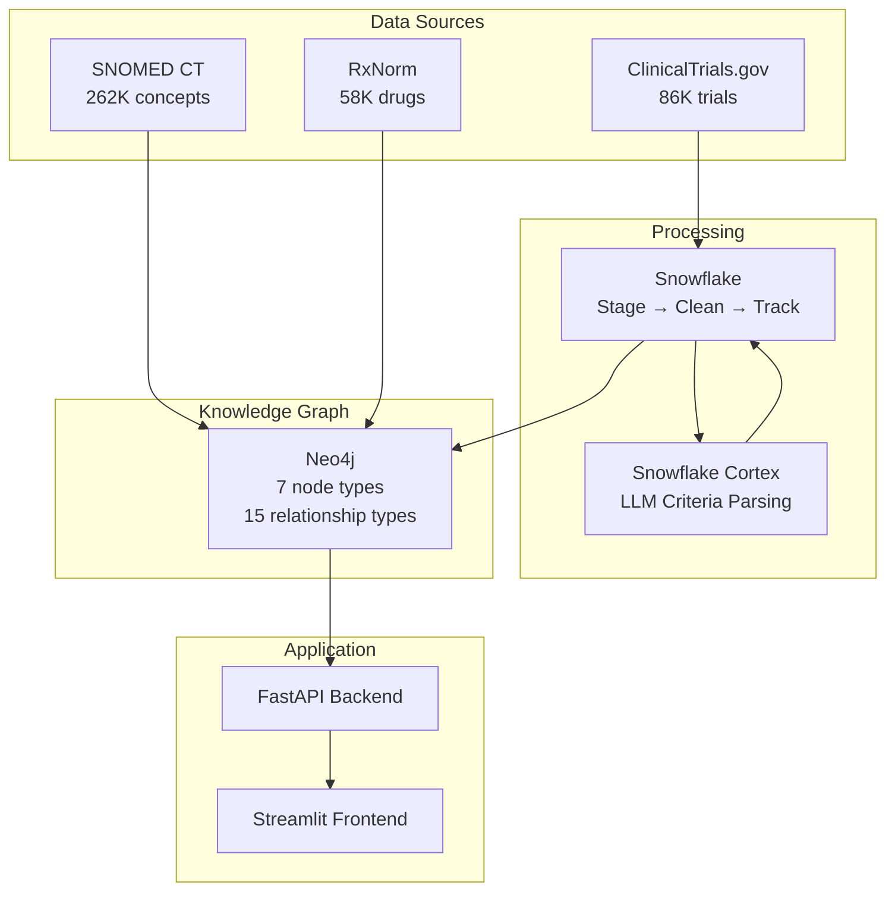
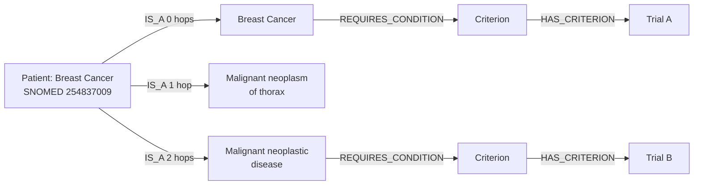
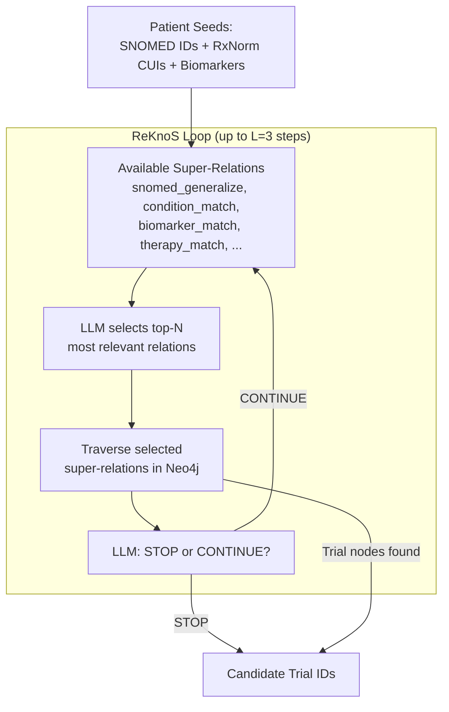

# Clinical Trial Eligibility Matcher — Project Overview

## What It Does

Matches patients to eligible clinical trials using a **Neo4j knowledge graph** built from 86,000+ trials (ClinicalTrials.gov), **SNOMED CT** (262K medical concepts), and **RxNorm** (58K drug concepts). The system offers **two retrieval approaches** — a deterministic graph traversal baseline and an LLM-guided multi-hop reasoning method inspired by our midterm research paper.

---

## Architecture



### Data Flow

1. **Ingest**: Fetch all recruiting trials from ClinicalTrials.gov API. Download SNOMED CT and RxNorm vocabularies.
2. **Stage & Clean (Snowflake)**: Load raw data, tag trials by therapeutic area (oncology, cardiology, etc.), split eligibility text into individual criteria sentences.
3. **Parse (Snowflake Cortex)**: Use `llama3.3-70b` to parse each criterion into structured JSON — extracting conditions, drugs, biomarkers, age constraints.
4. **Build Graph (Neo4j)**: Load SNOMED hierarchy (262K concepts + 490K IS_A edges), RxNorm drug graph (58K concepts), trial nodes, and parsed criteria with entity-linked edges (REQUIRES_CONDITION, EXCLUDES_PRIOR_DRUG, REQUIRES_BIOMARKER, etc.).
5. **Match**: Patient profile → graph traversal → exclusion filtering → scoring → ranked results.

### The 7 Node Types

| Node | Source | Count | Purpose |
|------|--------|-------|---------|
| **Trial** | ClinicalTrials.gov | 24,306 | Trial metadata (phase, status, age range, sponsor) |
| **Condition** | ClinicalTrials.gov | 15,450 | Disease studied by a trial |
| **Intervention** | ClinicalTrials.gov | 22,696 | Treatment used in a trial |
| **SNOMEDConcept** | SNOMED CT RF2 | 262,590 | Medical concept with IS_A hierarchy |
| **RxNormConcept** | RxNorm RRF | 58,635 | Drug concept (ingredients, brand names) |
| **Criterion** | Eligibility text + Cortex LLM | 1,166 | Parsed eligibility rule with entity links |
| **Biomarker** | Extracted from parsed criteria | ~20 | Molecular marker (HER2, EGFR, PD-L1) |

---

## Two Retrieval Approaches

The system implements two candidate retrieval methods. Both feed into the same exclusion filter and scoring pipeline — only Stage 1 differs.

### Approach 1: Baseline Graph Traversal (Deterministic)

Fixed SNOMED IS_A traversal — walks the medical hierarchy 0-3 hops upward from the patient's condition to find trials.



**Characteristics:**
- Deterministic — same input always gives same output
- Fast — pure Cypher queries, milliseconds
- $0 cost per query
- Fixed traversal depth (always 3 hops up the IS_A tree)
- May miss trials reachable via biomarker or drug paths

### Approach 2: ReKnoS Multi-hop Reasoning (LLM-Guided)

Adapted from our midterm research paper: **"Reasoning of Large Language Models over Knowledge Graphs with Super-Relations"** (Published as a conference paper at ICLR 2025). The paper introduces the concept of **super-relations** — abstract traversal steps that group semantically similar graph edges — and uses an LLM to select the most promising reasoning path at each hop.

Our implementation (`matcher/reknos_finder.py`, `matcher/super_relations.py`) adapts this framework to clinical trial matching:



**The 7 super-relations defined for our KG:**

| Super-Relation | Traversal | Example |
|---------------|-----------|---------|
| `snomed_generalize` | Walk UP IS_A hierarchy | Breast Cancer → Malignant neoplasm of thorax |
| `snomed_specialize` | Walk DOWN IS_A hierarchy | Breast Cancer → Lobular carcinoma of breast |
| `condition_match` | SNOMED → REQUIRES_CONDITION → Criterion | Find criteria requiring this condition |
| `condition_exclude` | SNOMED → EXCLUDES_CONDITION → Criterion | Find criteria excluding this condition |
| `biomarker_match` | Biomarker → REQUIRES_BIOMARKER → Criterion | HER2 → criteria requiring HER2+ |
| `therapy_match` | RxNorm → REQUIRES_PRIOR_DRUG → Criterion | Trastuzumab → criteria requiring prior trastuzumab |
| `criterion_to_trial` | Criterion → HAS_CRITERION → Trial | Final hop to get trial NCT IDs |

**Key difference from baseline:** ReKnoS can discover trials through **biomarker→criterion→trial** and **drug→criterion→trial** paths that the fixed IS_A traversal never explores. For example, a TMB-high patient might match tumor-agnostic immunotherapy trials that don't mention their specific cancer type.

**How it's used:** Results from ReKnoS are **unioned** with baseline results — the baseline is never degraded. ReKnoS only adds candidates the baseline missed.

**LLM call bound:** O(L) calls total (at most 2 per step: one for scoring relations, one for stop check). With L=3, that's at most 6 LLM calls per query.

### Toggling Between Approaches

The Streamlit frontend has a checkbox: **"ReKnoS Multi-hop Reasoning"**. The API exposes it as a query parameter: `?use_reknos=true`. Both approaches use the same exclusion filter (Stage 2) and scoring algorithm (Stage 3).

---

## Example: Matching Sarah

> **Patient:** 58-year-old female, HER2-positive breast cancer, prior trastuzumab, ECOG 1.

### Input (two options)

**Structured:** Select from dropdowns → SNOMED 254837009, RxNorm 224905, HER2=positive

**Free text:** Type description → gpt-4o-mini extracts fields → EntityLinker resolves to SNOMED/RxNorm IDs

### Matching Pipeline

```
Stage 1: Find Candidates
  ├── Baseline: IS_A traversal from 254837009 → ~15 candidate trials
  └── ReKnoS (optional): LLM-guided multi-hop → additional candidates via biomarker/drug paths
  → Combined: ~20 candidates

Stage 2: Exclusion Filter (per trial)
  ├── Age 58 in range? ✓
  ├── Gender Female matches? ✓
  ├── Trial excludes breast cancer? ✗ (pass)
  ├── Trial excludes trastuzumab? ✗ for most (1 trial excluded)
  └── Trial excludes HER2+? ✗ (pass)
  → ~17 survive

Stage 3: Score 0-100
  ├── Condition match (40 pts) — direct SNOMED match = 40, ancestor = 30
  ├── Biomarker match (25 pts) — HER2+ required and present = 25
  ├── Prior therapy  (15 pts) — no requirements = 10, required and present = 15
  ├── Demographics   (10 pts) — age in range + gender match = 10
  └── Trial quality  (10 pts) — Phase 3 + Recruiting + enrollment = 8-10

Stage 4: Top 10 + LLM explanations (optional, ~$0.01)
```

---

## Tech Stack

| Layer | Technology | Purpose |
|-------|-----------|---------|
| Data staging | Snowflake | Clean, tag, track parsing progress |
| Criteria parsing | Snowflake Cortex (llama3.3-70b) | One-time: text → structured JSON |
| Knowledge graph | Neo4j 5.x | Store and traverse medical ontology + trials |
| Entity linking | RapidFuzz + SNOMED/RxNorm lookups | Map free-text names to concept IDs |
| Matching engine | Python + Neo4j Cypher | Graph traversal + scoring |
| ReKnoS reasoning | Python + Neo4j + OpenAI gpt-4o-mini | LLM-guided multi-hop traversal |
| Backend | FastAPI | REST API (5 endpoints) |
| Frontend | Streamlit | Interactive patient input + trial results |
| Free text parsing | OpenAI gpt-4o-mini | Extract structured profile from natural language |
| Explanations | OpenAI gpt-4o-mini | Generate human-readable match explanations |

---

## Cost Profile

| Operation | Cost | Frequency |
|-----------|------|-----------|
| Graph matching (baseline) | $0 | Every query |
| ReKnoS multi-hop | ~$0.01 (6 LLM calls) | Every query with ReKnoS enabled |
| LLM explanations | ~$0.01 per 10 results | Optional, per query |
| Free text parsing | ~$0.001 | Only in free text input mode |
| Cortex criteria parsing | ~2-3 Snowflake credits | One-time data setup |

---

## Running the App

```bash
# Start Neo4j + load data (or restore from dump)
docker compose up -d
# ... load steps or dump restore ...

# Start backend and frontend
uvicorn api.main:app --reload        # http://localhost:8000
streamlit run frontend/app.py        # http://localhost:8501
```

Full setup instructions in [docs/SETUP_GUIDE.md](SETUP_GUIDE.md). Detailed technical walkthrough in [docs/PROJECT_DEEP_DIVE.md](PROJECT_DEEP_DIVE.md).
